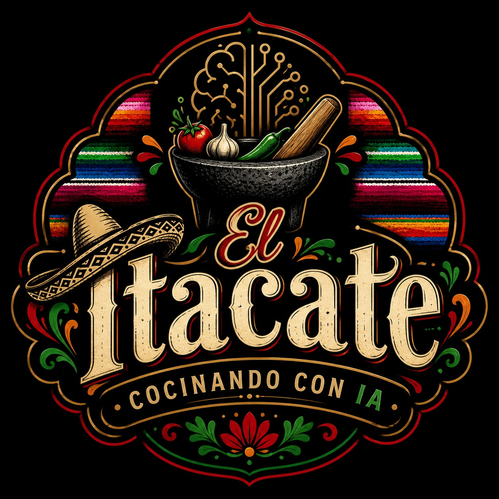

<p align="center">
  
</p>

<h1 align="center">🌮 El Itacate</h1>

<p align="center">
Agente de Inteligencia Artificial especializado en recetas de cocina mexicana.
</p>

---
# Chef IA — El Itacate

Agente de cocina mexicana construido con LangChain y Cohere. Lee los documentos del
proyecto, recupera solo el contexto relevante y conserva reglas deterministas para no
recomendar recetas fuera de la Biblioteca autorizada.

## Arquitectura

- **LangChain** crea y ejecuta el agente.
- **ChatCohere** genera la respuesta final a partir de una receta ya validada.
- **KnowledgeRetriever** fragmenta el conocimiento en memoria y entrega al agente solo
  los fragmentos relevantes. No requiere una base de datos ni envía el contenido completo
  de los documentos como una sola consulta.
- **ChefIAService** valida ingredientes, tipo de platillo y personas; además selecciona
  únicamente una receta existente en la Biblioteca.

La base de información se mantiene fuera de esta carpeta. El programa la recibe con
`--data-dir ..`, que significa “la carpeta superior”.

## Formatos que puede leer

| Formato | Librería |
| --- | --- |
| Word (`.docx`) | `python-docx` |
| PDF (`.pdf`) | `pypdf` |
| Excel (`.xlsx`, `.xls`) | `pandas` y `openpyxl` |
| PowerPoint (`.pptx`) | `python-pptx` |

Los archivos compatibles que estén en la carpeta indicada por `--data-dir` se incorporan
al recuperador local. Los seis documentos Word requeridos siguen siendo obligatorios.

## Configuración inicial

Abre PowerShell dentro de `Agente Itacate` y activa el entorno virtual:

```powershell
cd "C:\Users\Angela\Documents\Agente IA\Agente Itacate"
.\.venv\Scripts\Activate.ps1
$env:PYTHONPATH = "src"
```

Si PowerShell bloquea la activación, no cambies la política global: usa directamente
`.\.venv\Scripts\python.exe` en los comandos que aparecen abajo.

### Configurar la clave de Cohere

1. Entra a [Cohere Dashboard](https://dashboard.cohere.com/api-keys) e inicia sesión o crea una cuenta.
2. Genera una API key y cópiala.
3. En PowerShell, crea tu archivo privado de configuración:

```powershell
Copy-Item .env.example .env
notepad .env
```

4. Sustituye `pega_tu_clave_aqui` por la clave copiada y guarda el archivo.

El archivo `.env` está excluido por `.gitignore`. No lo compartas ni lo subas a un repositorio.

## Ejecutar

Primero confirma que la base se puede leer:

```powershell
python -B -m chef_ia --data-dir .. --show-knowledge
```

Para iniciar el agente conectado a Cohere:

```powershell
python -B -m chef_ia --data-dir ..
```

Para probar el flujo sin una clave ni conexión a Cohere, usa el modo local:

```powershell
python -B -m chef_ia --data-dir .. --offline
```

## Pruebas

```powershell
python -B -m unittest discover -s tests -v
```

Si PowerShell bloqueó `Activate.ps1`, ejecuta las pruebas sin activar el entorno:

```powershell
$env:PYTHONPATH = "src"
& ".\.venv\Scripts\python.exe" -B -m unittest discover -s tests -v
```

## Vista web local

La vista usa HTML, CSS y JavaScript nativos. No incluye React, Bootstrap ni un framework
web adicional. Desde `Agente Itacate`, inicia el servidor con:

```powershell
python -B -m chef_ia.web_server --data-dir ..
```

En equipos donde la política de PowerShell bloquee `Activate.ps1`, usa este comando
equivalente. No necesitas cambiar la política de ejecución ni instalar pandas globalmente:

```powershell
$env:PYTHONPATH = "src"
& ".\.venv\Scripts\python.exe" -B -m chef_ia.web_server --data-dir ..
```

Después abre [http://localhost:8080](http://localhost:8080). La aplicación muestra las
políticas antes de habilitar el chat. El primer ingrediente escrito es el principal: la
vista presenta hasta tres recetas compatibles y permite elegir una antes de consultar a
Cohere. La clave de Cohere permanece únicamente en `.env`.

## OCI Container Instances

El proyecto incluye un `Dockerfile` en la carpeta raíz. Desde esa carpeta, crea la imagen:

```powershell
docker build -t el-itacate -f Dockerfile .
```

Para probarla localmente sin exponer la clave dentro de la imagen:

```powershell
docker run --rm -p 8080:8080 --env-file "Agente Itacate/.env" el-itacate
```

En OCI, publica la imagen en un registro autorizado y crea una Container Instance con el
puerto `8080`, el health check HTTP en `/health` y `COHERE_API_KEY` configurada como secreto
o variable de entorno de la instancia. No copies `.env` a la imagen ni al registro.

## Estructura

```text
Agente Itacate/
  .env.example          # Plantilla segura de configuración.
  .gitignore            # Evita publicar secretos y archivos temporales.
  requirements.txt       # Dependencias reproducibles.
  src/chef_ia/
    agent.py             # Agente LangChain con ChatCohere.
    document_loader.py   # Lectores Word, PDF, Excel y PowerPoint.
    knowledge.py         # Validación y carga de conocimiento del proyecto.
    retriever.py         # Fragmentación y recuperación local de contexto.
    service.py           # Reglas deterministas de selección de recetas.
    settings.py          # Lectura segura de variables de entorno.
  tests/                 # Pruebas automáticas.
```

## Normalización de ingredientes

`Ingredientes.docx` es la fuente de verdad para ingredientes complementarios. Al iniciar,
el programa crea un catálogo normalizado sin acentos y reconoce singular/plural, por
ejemplo `huevo`/`huevos`. También interpreta `chile` como categoría de sus variedades
documentadas (como `chile serrano`) y `queso` como categoría de quesos. También carga las
categorías comunes del documento: proteínas, verduras, frutas, leguminosas, cereales,
lácteos y condimentos. La categoría `carne` comprende únicamente `carne de res` y `carne de
cerdo`, porque son las carnes explícitas del documento. Las equivalencias lingüísticas seguras
(`tomate` → `jitomate`, `aceite vegetal` → `aceite`) están centralizadas en ese catálogo; no
existen listas duplicadas de ingredientes dentro del servicio.

## Límites funcionales

Chef IA solo responde sobre recetas mexicanas sencillas de la Biblioteca. No crea recetas,
no da dietas ni indicaciones médicas, no responde alergias, y no recomienda bebidas
alcohólicas, postres o cocina internacional. Las recomendaciones son informativas y la
persona usuaria conserva la responsabilidad por higiene, ingredientes y seguridad.

No se clasifica la recomendación por desayuno, comida, cena o antojito: cualquier receta
autorizada puede recomendarse en cualquier momento, siempre que cumpla las reglas de
ingredientes.

Antes de iniciar, la consola presenta las Políticas de Uso completas y requiere aceptarlas.
El primer ingrediente proporcionado por la persona es la base obligatoria de la receta.
Los faltantes solo pueden completarse con ingredientes o categorías definidas en
`Ingredientes.docx`; el agente no usa otros extras ni crea recetas nuevas.
